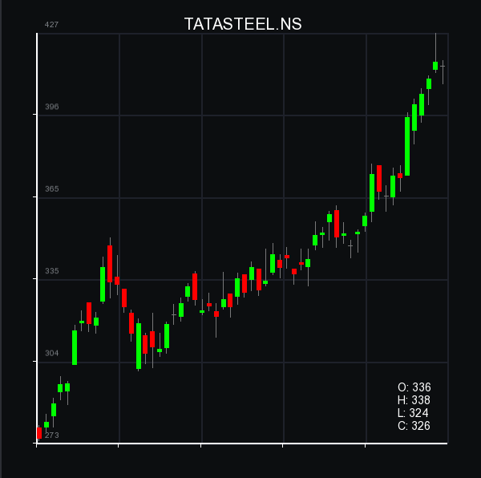

#Barebones candlestick chart

A C++ program for displaying historical stock data in a candlestick format. Dependency on SFML, a multimedia library.

#### Random colors for candles (press c to randomize)

### Ideas left to implement (aka TODO):
* ~~Custom kawaii colors~~ + white bg
* user input html color codes for backgrounds, bullish candles and bearish candles
* ~~x-axis markings~~
* zoomability  (scale time period)
* horizontal mouse drag to change the time period (also with left/right arrow keys)
* detect marubozus, dojis, and other typical single as well as multi-candle patterns.
* draw MACD, get VWAP
* indicate volume
* show help commands upon pressing h 
* refactor hardcoded dimensions
* ability to draw custom lines/ curves
* keyboard shortcut to reset all the changed plot behaviours
* convert to renko charts
* identify x coordinate marking format and convert into other compact notations
* specify the csv file as a terminal command
* figure out the title of the graph from the file name. Override if custom name specified as command line argument.
* save user preferences in a local file and load that at startup.
